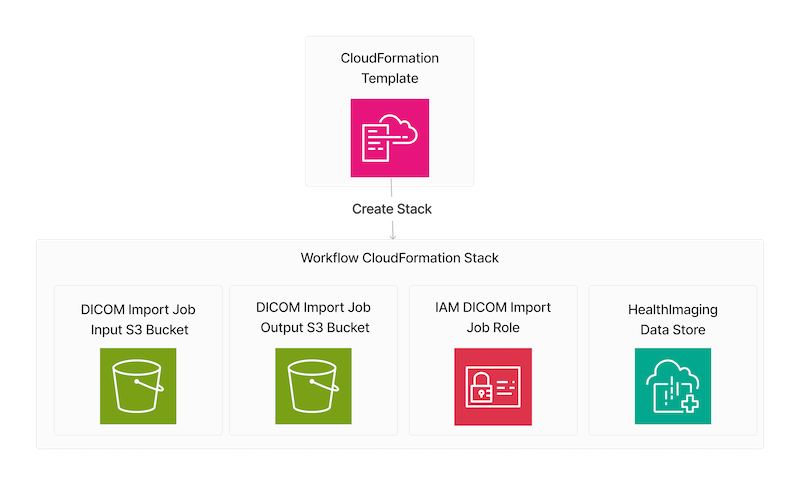
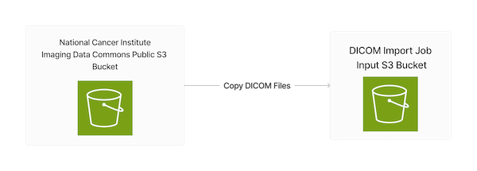
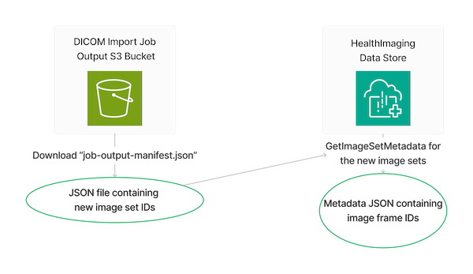

# Import HealthImaging Image Sets and Download Image Frames using AWS SDKs

## Overview

This workflow shows how to use the AWS SDKs to import DICOM files into
an AWS HealthImaging data store. It then shows how to download, decode and verify the image
frames created by the DICOM import.

Digital Imaging and Communications in Medicine (DICOM) is a technical standard for the digital storage and transmission of medical images and related information.

This workflow runs as a command-line application prompting for user input. 

1. All the necessary resources are created from an AWS CloudFormation template.
   1. A HealthImaging data store.
   2. An Amazon Simple Storage Service (Amazon S3) input bucket for a DICOM import job.
   3. An Amazon S3 output bucket for a DICOM import job. 
   4. An AWS Identity and Access Management (IAM) role with the appropriate permissions for a DICOM import job.

2. The user chooses a DICOM study to copy from the [National Cancer Institute Imaging Data Commons (IDC) Collections](https://registry.opendata.aws/nci-imaging-data-commons/)' public S3 bucket.
3. The chosen study is copied to the user's input S3 bucket.

4. A HealthImaging DICOM import job is run.

5. The workflow retrieves the IDs for the HealthImaging image frames created by the DICOM import job.

6. The HealthImaging image frames are downloaded, decoded to a bitmap format, and verified using a CRC32 checksum.
7. The created resources can then be deleted, if the user chooses.

## Additional resources

* [HealthImaging User Guide](https://docs.aws.amazon.com/healthimaging/latest/devguide/what-is.html)
* [HealthImaging API Reference](https://docs.aws.amazon.com/healthimaging/latest/APIReference/Welcome.html)

---

Copyright Amazon.com, Inc. or its affiliates. All Rights Reserved.

SPDX-License-Identifier: Apache-2.0